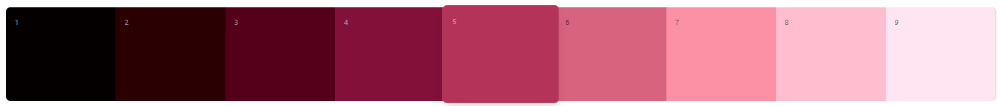
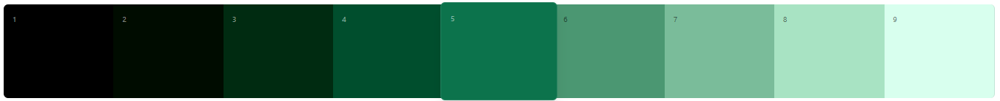

# Rosarium

I'm a whimsy little girl so I've chosen to create a "design system" and Gemini helped me give it a very cringey gothy name. It's just a handful of components and styles that I want to keep unified but I'll just go with it.

Here's a smattering of notes but hopefully I can make a Storybook eventually.

## Palettes

Palettes generated with [Significa's palette generator](https://palette-generator.significa.co/?c=0D734C&s=10&cs=0.1&cm=0)

### Rosarium

> **rŏsārĭum**<br/>
> _neutral noun II declension_
>
> 1 rosary<br/>
> 2 rose-garden<br/>
> 3 rose-bed

#### Old Palette


```json
[
  "#2a0003",
  "#55001b",
  "#831138",
  "#b33458", // Rosarium
  "#d8637e",
  "#fc90a6",
  "#ffbecf",
  "#ffe4f2",
]
```

#### New Palette
Starting with:
`500: "#b23464"`


### Silva

> **silva**<br/>
> _feminine noun I declension_
>
> 1 wood, forest<br/>
> 2 (poetic) branches, bushes, shrubbery, bush<br/>
> 3 (in the plural) trees, plants



```json
[
  "#000c00",
  "#002b11",
  "#004e2d",
  "#0d734c", // Silva
  "#4b9772",
  "#7abc99",
  "#a8e3c3",
  "#d8ffee"
]
```

(blue: nox/mare/aequor/indicum, purple: viola/dircium/crepusculum)

night, sea, surface of the sea, indigo / violet, nightshade, twilight

### Grayscale

10% lightness step

```json
[
  "#000000",
  "#1a1a1a",
  "#333333",
  "#4d4d4d",
  "#666666",
  "#808080",
  "#999999",
  "#b3b3b3",
  "#cccccc",
  "#e6e6e6",
  "#ffffff"
]
```
